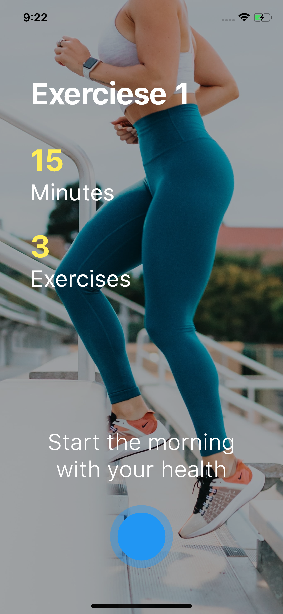
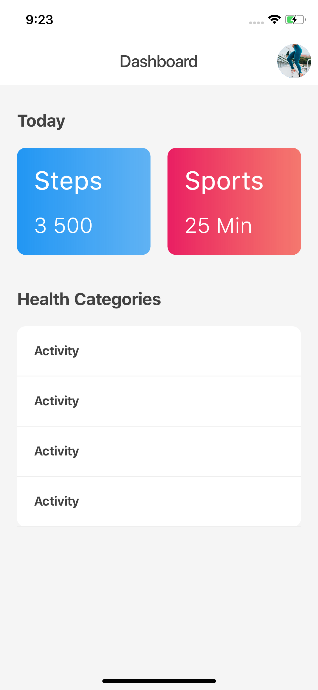

## Flutter Page Transition Animation, Application Design - Day 6

[Youtube Video](https://youtu.be/KEUKRT9Xsls)

**Fitness UI** est une application Flutter qui propose une interface utilisateur pour une application de fitness. L'application comprend une page d'accueil animée, un tableau de bord pour visualiser les activités de fitness, et plusieurs animations pour améliorer l'expérience utilisateur.

## Development Setup
Clone the repository and run the following commands:
```
flutter pub get
flutter run
```

## ScreenShot

&nbsp;

## Structure du Projet

Le projet est organisé de la manière suivante :

**lib/**: Contient le code source de l'application.
  - **main.dart**: Point d'entrée principal de l'application. Configure le thème et la page d'accueil.
  
  - **pages/**: Contient les pages principales de l'application.
    - **home_page.dart**: Page d'accueil de l'application, avec des animations et une navigation vers le tableau de bord.
    - **dashboard.dart**: Page du tableau de bord qui affiche les informations sur les activités de fitness.
  
  - **animation/**: Contient les animations personnalisées utilisées dans l'application.
    - **fade_animation.dart**: Définit une animation de fondu utilisée pour les transitions d'éléments dans l'application.

## Description des fichiers

<details>
<summary>1.1 main.dart</summary>

- Ce fichier est le point d'entrée de l'application. Il configure le thème global et définit la page d'accueil par défaut.

    - **MyApp**:
        - Classe principale qui étend `StatelessWidget`. Elle initialise l'application avec un `MaterialApp`.
        - Elle configure le thème de l'application avec `ThemeData`, en utilisant Material 3.
        - La propriété `home` est définie sur `HomePage()`, ce qui signifie que la page d'accueil sera affichée au lancement de l'application.
</details>

<details>
<summary>1.2 pages/home_page.dart</summary>

- Ce fichier définit la page d'accueil de l'application. Voici une explication de son contenu :

    - **HomePage**:
        - Classe qui étend `StatefulWidget`, représentant la page d'accueil de l'application.
        - Elle utilise plusieurs animations pour rendre l'interface plus dynamique, comme des effets de fondu.
        - La page d'accueil contient des images et des boutons animés. L'utilisateur peut naviguer vers le tableau de bord via un bouton d'action flottant.
    
    - **_HomePageState**:
        - Cette classe gère l'état de `HomePage` et contient la logique pour les animations et la gestion des interactions utilisateur.
        - Des `AnimationController` et `PageController` sont utilisés pour synchroniser et contrôler les animations sur la page.
</details>

<details>
<summary>1.3 pages/dashboard.dart</summary>

- Ce fichier définit la page du tableau de bord, où l'utilisateur peut voir un résumé des activités de fitness.

    - **Dashboard**:
        - Classe qui étend `StatelessWidget` et représente la page de tableau de bord de l'application.
        - Elle affiche une grille de cartes avec des informations sur les activités de fitness telles que les calories brûlées, le nombre de pas, etc.
        - Chaque carte peut inclure des informations supplémentaires et des options pour consulter plus de détails.
</details>

<details>
<summary>1.4 animation/fade_animation.dart</summary>

- Ce fichier définit une animation de fondu utilisée dans l'application pour animer l'apparition et la disparition des éléments de l'interface utilisateur.

    - **FadeAnimation**:
        - Classe qui étend `StatelessWidget`, appliquant une animation de fondu sur son enfant.
        - Le widget enfant est enveloppé dans un `FadeTransition`, qui est contrôlé par un `AnimationController`.
        - L'animation rend l'apparition des éléments plus fluide et dynamique, en ajustant l'opacité sur une durée spécifiée.
</details>
